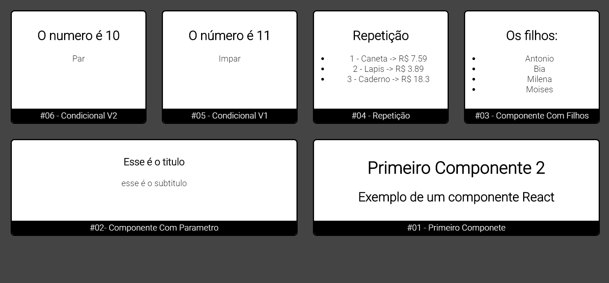

<h3 align="center">
    
    <br><br>
    <br>
</h3

## :rocket: This project was developed in order to improve knowledge about ReactJS, with Internet classes.

## :fire: How to use:

In the project directory, you can run:

```sh
  # Install the dependencies
  $ yarn 

  # Launch the web application
  $ yarn start
```

 
 <br>

 <br><br>


 <h4 align="center">
    Feito com 💜 by <a href="https://www.linkedin.com/in/antonio-carlos-44b106129/" target="_blank">Antonio Carlos</a>
</h4>